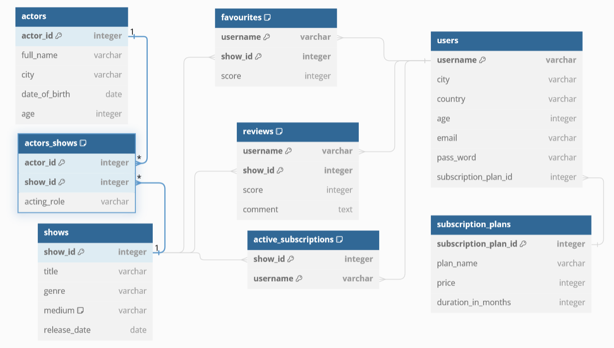

# Task 1



The ER model is based on PostgreSQL. The difference with MySQL is VARCHAR does not require a specific number. The diagram can be reproduced on `dbdiagram.io/d` using the code in `supporting materials/code for erd.txt`.

# Task 2

```
DROP DATABASE IF EXISTS bda_proj_2;

CREATE DATABASE bda_proj_2;

\c bda_proj_2;

-- Task 2.

CREATE TABLE actors (
    actor_id SERIAL PRIMARY KEY,
    full_name VARCHAR,
    city VARCHAR,
    date_of_birth DATE,
    age INT
);

CREATE TABLE shows (
    show_id SERIAL PRIMARY KEY,
    title VARCHAR,
    genre VARCHAR,
    medium VARCHAR,
    release_date DATE
);

CREATE TABLE actors_shows (
    actor_id INT REFERENCES actors(actor_id) ON DELETE NO ACTION,
    show_id INT REFERENCES shows(show_id) ON DELETE NO ACTION,
    acting_role VARCHAR,
    PRIMARY KEY (actor_id, show_id)
);

CREATE TABLE subscription_plans (
    subscription_plan_id SERIAL PRIMARY KEY,
    plan_name VARCHAR,
    price INT,
    duration_in_months INT
);

CREATE TABLE users (
    username VARCHAR PRIMARY KEY,
    city VARCHAR,
    country VARCHAR,
    age INT,
    email VARCHAR,
    pass_word VARCHAR,
    subscription_plan_id INT REFERENCES subscription_plans(subscription_plan_id) ON DELETE NO ACTION
);

CREATE TABLE favourites (
    username VARCHAR REFERENCES users(username) ON DELETE CASCADE,
    show_id INT REFERENCES shows(show_id) ON DELETE NO ACTION,
    score INT,
    PRIMARY KEY (username, show_id)
);

CREATE TABLE reviews (
    username VARCHAR REFERENCES users(username) ON DELETE CASCADE,
    show_id INT REFERENCES shows(show_id) ON DELETE NO ACTION,
    score INT,
    comment TEXT,
    PRIMARY KEY (username, show_id)
);

CREATE TABLE active_subscriptions (
    show_id INT REFERENCES shows(show_id) ON DELETE NO ACTION,
    username VARCHAR REFERENCES users(username) ON DELETE NO ACTION,
    PRIMARY KEY (show_id, username)
);

```

The SQL script is based on PostgreSQL. The differences with MySQL are a number is not required for VARCHAR, and connection to the database requires 'USE' instead of '\c'.

# Task 3

```
INSERT INTO actors
    (full_name, city, date_of_birth, age)
VALUES
    ('Millie Bobby Brown', 'Los Angeles', '2004-02-19', 20),
    ('Bryan Cranston', 'Hollywood', '1956-03-07', 68),
    ('Winona Ryder', 'New York', '1971-10-29', 52),
    ('Aaron Paul', 'Boise', '1979-08-27', 44),
    ('David Harbour', 'White Plains', '1975-04-10', 49)
RETURNING *;

INSERT INTO shows
    (title, genre, medium, release_date)
VALUES
    ('Stranger Things', 'Sci-Fi', 'tv','2016-07-15'),
    ('Breaking Bad', 'Drama', 'tv','2008-01-20'),
    ('The Office', 'Comedy', 'tv','2005-03-24'),
    ('Parks and Recreation','Comedy', 'tv', '2009-04-09'),
    ('The Godfather', 'Crime', 'movie','1972-03-24')
RETURNING *;

INSERT INTO actors_shows
    (actor_id, show_id, acting_role)
VALUES
    (1, 1, 'Eleven'),
    (2, 2, 'Walter White'),
    (3, 1, 'Joyce Byers'),
    (4, 2, 'Jesse Pinkman'),
    (5, 1, 'Jim Hopper')
RETURNING *;

INSERT INTO subscription_plans
    (plan_name, price, duration_in_months)
VALUES
    ('HD', 9.99, 1),
    ('UHD', 14.99, 1)
RETURNING *;

INSERT INTO users
    (username, email, pass_word, subscription_plan_id, city, country, age)
VALUES
    ('john_doe', 'john@example.com', 'password1', 1, 'New York', 'USA', 28),
    ('alice_smith', 'alice@example.com', 'password2', 1, 'Los Angeles', 'USA', 34),
    ('jane_doe', 'jane@example.com', 'password3', 2, 'Chicago', 'USA', 21),
    ('bob_jones', 'bob@example.com', 'password4', 2, 'Boston', 'USA', 30),
    ('emma_johnson', 'emma@example.com', 'password5', 1, 'San Francisco', 'USA', 25)
RETURNING *;

INSERT INTO favourites
    (username, show_id, score)
VALUES
    ('john_doe', 3, 5),
    ('john_doe', 4, 4),
    ('alice_smith', 5, 3),
    ('jane_doe', 1, 5),
    ('bob_jones', 2, 4)
RETURNING *;

INSERT INTO reviews
    (username, show_id, score, comment)
VALUES
    ('john_doe', 1, 5, 'Amazing show!'),
    ('alice_smith', 2, 3, 'Good show'),
    ('jane_doe', 3, 4, 'Funny and smart'),
    ('bob_jones', 4, 2, 'Not my taste'),
    ('emma_johnson', 5, 5, 'A classic!')
RETURNING *;

INSERT INTO active_subscriptions
    (show_id, username)
VALUES
    (1, 'john_doe'),
    (2, 'alice_smith'),
    (3, 'jane_doe'),
    (4, 'bob_jones'),
    (5, 'emma_johnson')
RETURNING *;

```

The SQL script is based on PostgreSQL. The difference with MySQL is RETURNING * will need to be removed.

# Task 4

```
\echo '\n 4.1 Export all data about users in the HD subscriptions.'
SELECT users.*, plan_name
FROM users
INNER JOIN subscription_plans USING (subscription_plan_id)
WHERE plan_name = 'HD';

\echo '\n 4.2 Export all data about actors and their associated movies.'
SELECT *
FROM actors
LEFT JOIN actors_shows USING (actor_id)
LEFT JOIN shows USING (show_id);

\echo '\n 4.3 Export all data to group actors from a specific city, showing also the average age (per city).'
SELECT city, COUNT(actor_id) AS "number_of_actors", AVG(age) AS "average_age"
FROM actors
GROUP BY city;

\echo '\n 4.4 Export all data to show the favourite comedy movies for a specific user.'
SELECT *
FROM favourites
INNER JOIN shows USING (show_id)
WHERE genre = 'Comedy'
    AND username = 'john_doe';

\echo '\n 4.5 Export all data to count how many subscriptions are in the database per country.'
SELECT country, COUNT(show_id) AS "subscription_count"
FROM users
LEFT JOIN active_subscriptions USING (username)
GROUP BY country;

\echo '\n 4.6 Export all data to find the movies that start with the keyword The .'
SELECT *
FROM shows
WHERE title LIKE 'The%';

\echo '\n 4.7 Export data to find the number of subscriptions per movie category.'
SELECT genre, COUNT(username) as "subscription_count"
FROM shows
LEFT JOIN active_subscriptions USING (show_id)
GROUP BY genre;

\echo '\n 4.8 Export data to find the username and the city of the youngest customer in the UHD subscription category.'
WITH uhd_plan_id AS (
    SELECT subscription_plan_id
    FROM subscription_plans
    WHERE plan_name = 'UHD'
),
min_age_of_uhd AS (
    SELECT MIN(age) as age
    FROM users
    WHERE subscription_plan_id = (SELECT subscription_plan_id FROM uhd_plan_id)
)
SELECT username, city, age, plan_name
FROM users
INNER JOIN subscription_plans USING (subscription_plan_id)
WHERE plan_name = 'UHD'
    AND age = (SELECT age FROM min_age_of_uhd);

\echo '\n 4.9 Export data to find users between 22 - 30 years old (including 22 and 30 ).'
SELECT *
FROM users
WHERE age BETWEEN 22 AND 30;

\echo '\n 4.10 Export data to find the average age of users with low score reviews (less than 3). Group your data for users under 20, 21-40, and 41 and over.'
WITH low_score_users AS (
    SELECT username
    FROM reviews
    WHERE score < 3
)
SELECT AVG(age) AS "average_age",
CASE
    WHEN age <= 20 THEN 'under 20'
    WHEN age BETWEEN 21 AND 40 THEN '21 - 40'
    WHEN age >= 41 THEN '41 and over'
END AS "age_group"
FROM users
WHERE username IN (SELECT username FROM low_score_users)
GROUP BY age;

```

The SQL script is based on PostgreSQL. It should work nicely in MySQL as well. The 'echo' statements are just for formatting in the generated text files. I use joins whenever I want a certain column displayed for all rows, but when that is not required I use CTEs to avoid using joins. I use outer joins whenever I want to show rows even with no associated joins or a 0 count. More inserted rows would better test the script, but due to time constraints only the data given in the spec was inserted in Task 3. Having your own INSERTs will show nicer results.

# Task 5

```
import pg8000.native

from config._env_development import (user, password, database, host)

connection = pg8000.native.Connection(user=user, password=password, database=database, host=host)


def query_1(plan_name):
    query = f'''
        SELECT users.*, plan_name
        FROM users
        INNER JOIN subscription_plans USING (subscription_plan_id)
        WHERE plan_name = '{plan_name}';
    '''
    rows = connection.run(query)
    columns = [metadata['name'] for metadata in connection.columns]
    print('Column names in order: ', columns)
    for row in rows:
        print(row)


def query_2(full_name):
    query = f'''
        SELECT *
        FROM actors
        LEFT JOIN actors_shows USING (actor_id)
        LEFT JOIN shows USING (show_id)
        WHERE full_name = '{full_name}';
    '''
    rows = connection.run(query)
    columns = [metadata['name'] for metadata in connection.columns]
    print('Column names in order: ', columns)
    for row in rows:
        print(row)


def query_3(city):
    query = f'''
        SELECT city, COUNT(actor_id) AS "number_of_actors", AVG(age) AS "average_age"
        FROM actors
        WHERE city = '{city}'
        GROUP BY city;
    '''
    rows = connection.run(query)
    columns = [metadata['name'] for metadata in connection.columns]
    print('Column names in order: ', columns)
    for row in rows:
        print(row)


def query_4(genre, username):
    query = f'''
        SELECT *
        FROM favourites
        INNER JOIN shows USING (show_id)
        WHERE genre = '{genre}'
            AND username = '{username}';
    '''
    rows = connection.run(query)
    columns = [metadata['name'] for metadata in connection.columns]
    print('Column names in order: ', columns)
    for row in rows:
        print(row)


def query_5(country):
    query = f'''
        SELECT country, COUNT(show_id) AS "subscription_count"
        FROM users
        LEFT JOIN active_subscriptions USING (username)
        WHERE country = '{country}'
        GROUP BY country;
    '''
    rows = connection.run(query)
    columns = [metadata['name'] for metadata in connection.columns]
    formatted_results = [
        {column: row[i] for (i, column) in enumerate(columns)}
        for row in rows
    ]
    for row in formatted_results:
        print(row)


def run_queries_with_fixed_inputs():
    query_1('HD')
    query_1('UHD')
    query_2('Millie Bobby Brown')
    query_2('Bryan Cranston')
    query_3('Los Angeles')
    query_3('Hollywood')
    query_4('Comedy', 'john_doe')
    query_5('USA')


run_queries_with_fixed_inputs()


def run_queries_with_user_inputs():
    plan_name = input('Enter a plan name to view users under that plan: ')
    query_1(plan_name)
    full_name = input("Enter an actor's full name to view all data of her and her associated shows: ")
    query_2(full_name)
    city = input('Enter a city to find the number of actors in that city and their average age: ')
    query_3(city)
    genre = input('Enter a genre first: ')
    username = input("Then enter a username to view that user's favourite shows in that genre: ")
    query_4(genre, username)
    country = input('Enter a country to find the total number of subscriptions in that country: ')
    query_5(country)


run_queries_with_user_inputs()

```

There are two versions of the task provided in the Python script, one with fixed inputs and one with user inputs. Most of the queries' outputs are in a similar format, but query 5's output demonstrate a different way to display the results obtained from a query. If you want to run the script, replace the parameters on line 5, or create a file with the secrets as detailed in the README.

# Task 6

```
CREATE KEYSPACE bda_proj_2
WITH REPLICATION = {
    'class': 'SimpleStrategy',
    'replication_factor': 3
};

USE bda_proj_2;

CREATE TABLE bda_proj_2.users (
    username TEXT,
    city TEXT,
    country TEXT,
    age INT,
    email TEXT,
    pass_word TEXT,
    subscription_plan_id INT,
    PRIMARY KEY (username)
);

INSERT INTO bda_proj_2.users
    (username, email, pass_word, subscription_plan_id, city, country, age)
VALUES
    ('john_doe', 'john@example.com', 'password1', 1, 'New York', 'USA', 28);
INSERT INTO bda_proj_2.users
    (username, email, pass_word, subscription_plan_id, city, country, age)
VALUES
    ('alice_smith', 'alice@example.com', 'password2', 1, 'Los Angeles', 'USA', 34);
INSERT INTO bda_proj_2.users
    (username, email, pass_word, subscription_plan_id, city, country, age)
VALUES
    ('jane_doe', 'jane@example.com', 'password3', 2, 'Chicago', 'USA', 21);
INSERT INTO bda_proj_2.users
    (username, email, pass_word, subscription_plan_id, city, country, age)
VALUES
    ('bob_jones', 'bob@example.com', 'password4', 2, 'Boston', 'USA', 30);
INSERT INTO bda_proj_2.users
    (username, email, pass_word, subscription_plan_id, city, country, age)
VALUES
    ('emma_johnson', 'emma@example.com', 'password5', 1, 'San Francisco', 'USA', 25);

CREATE INDEX ON bda_proj_2.users (country);
CREATE INDEX ON bda_proj_2.users (city);

```

The above script is for Task 6.1. It should be run on cqlsh. INSERT INTO statements are required for each row in Cassandra unless a different method is used. Indices are created for 'country' and 'city' to facilitate the queries in Tasks 6.3 and 6.5 by allowing me not to use ALLOW FILTERING.

```
# Import the driver
from cassandra.cluster import Cluster 

# Create a new cluster
cluster = Cluster() 

# Connect to the cluster's default port
cluster = Cluster(['172.17.0.2','172.17.0.3','172.17.0.4'], port=9042)

# Create the database using CQL first

# Connect to bda_proj_2
session = cluster.connect('bda_proj_2') 
session.set_keyspace('bda_proj_2')

# Use the preffered keyspace
session.execute('USE bda_proj_2') 


def run_query_without_inputs(query):
    # Run a query
    rows = session.execute(query)

    # Iterate and show the query response
    for i in rows: 
        print(i)


print('task 6.2:\n')
query_6_2 = '''
    SELECT *
    FROM bda_proj_2.users;
'''
run_query_without_inputs(query_6_2)
print('\ntask 6.3:\n')
query_6_3 = '''
    SELECT *
    FROM bda_proj_2.users
    WHERE country = 'USA';
'''
run_query_without_inputs(query_6_3)
print('\ntask 6.4:\n')
query_6_4 = '''
    SELECT *
    FROM bda_proj_2.users
    WHERE age >= 22
    AND age <= 30
    ALLOW FILTERING;
'''
run_query_without_inputs(query_6_4)
print('\ntask 6.5:\n')
query_6_5 = '''
    SELECT city, COUNT(username) as "number_of_users"
    FROM bda_proj_2.users
    WHERE city = 'Boston';
'''
run_query_without_inputs(query_6_5)
query_6_5 = '''
    SELECT city, COUNT(username) as "number_of_users"
    FROM bda_proj_2.users
    WHERE city = 'Los Angeles';
'''
run_query_without_inputs(query_6_5)
query_6_5 = '''
    SELECT city, COUNT(username) as "number_of_users"
    FROM bda_proj_2.users
    WHERE city = 'New York';
'''
run_query_without_inputs(query_6_5)
query_6_5 = '''
    SELECT city, COUNT(username) as "number_of_users"
    FROM bda_proj_2.users
    WHERE city = 'San Francisco';
'''
run_query_without_inputs(query_6_5)
# An example with user inputs
query_6_5 = '''
    SELECT city, COUNT(username) as "number_of_users"
    FROM bda_proj_2.users
    WHERE city = %s;
'''
city = input('Enter a city to count the number of users (e.g. Chicago): ')
rows = session.execute(query_6_5, [city])
for i in rows: 
    print(i)

```

The above script is for Tasks 6.2 - 6.5. For Task 6.4, indexing doesn't work when the query involves a range, so I used ALLOW FILTERING. BETWEEN cannot be used in the WHERE clause as well, so I used AND. For Task 6.5, GROUP BY can only be used with primary keys in Cassandra, so a separate query is run for each city instead. The very last query of Task 6.5 is used to demonstrate a way of querying with user input.
